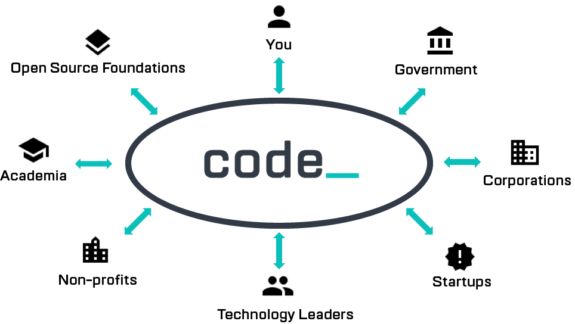
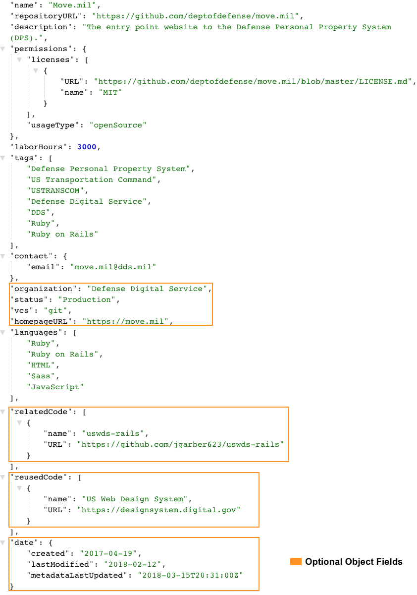
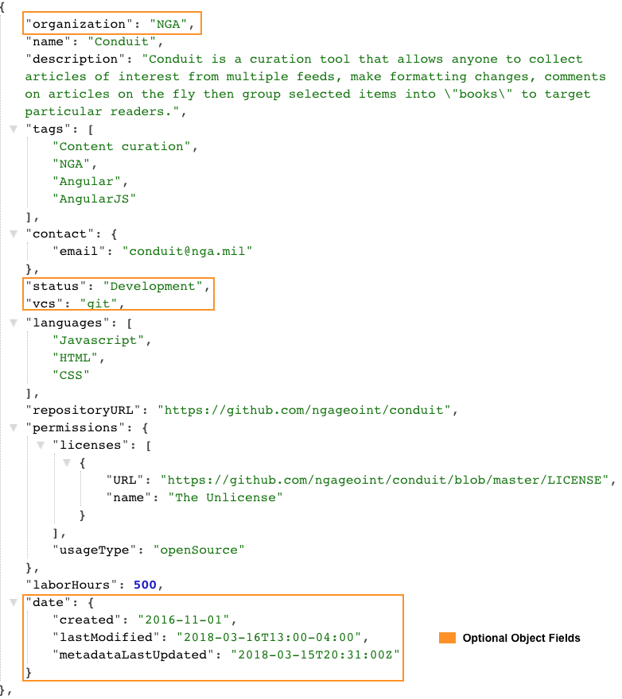
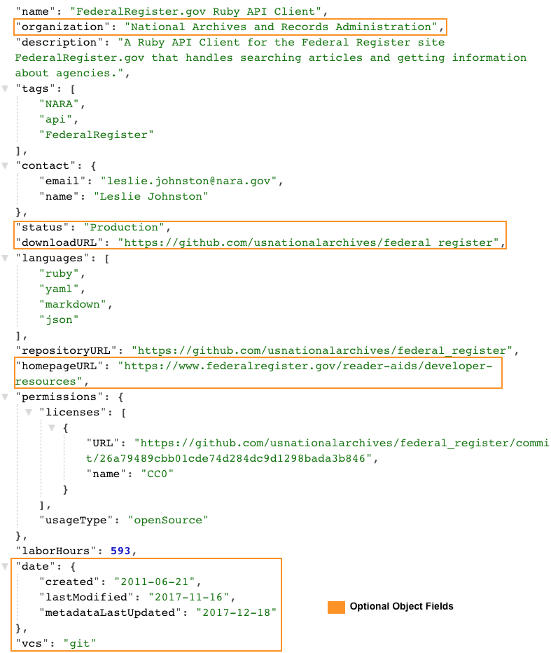
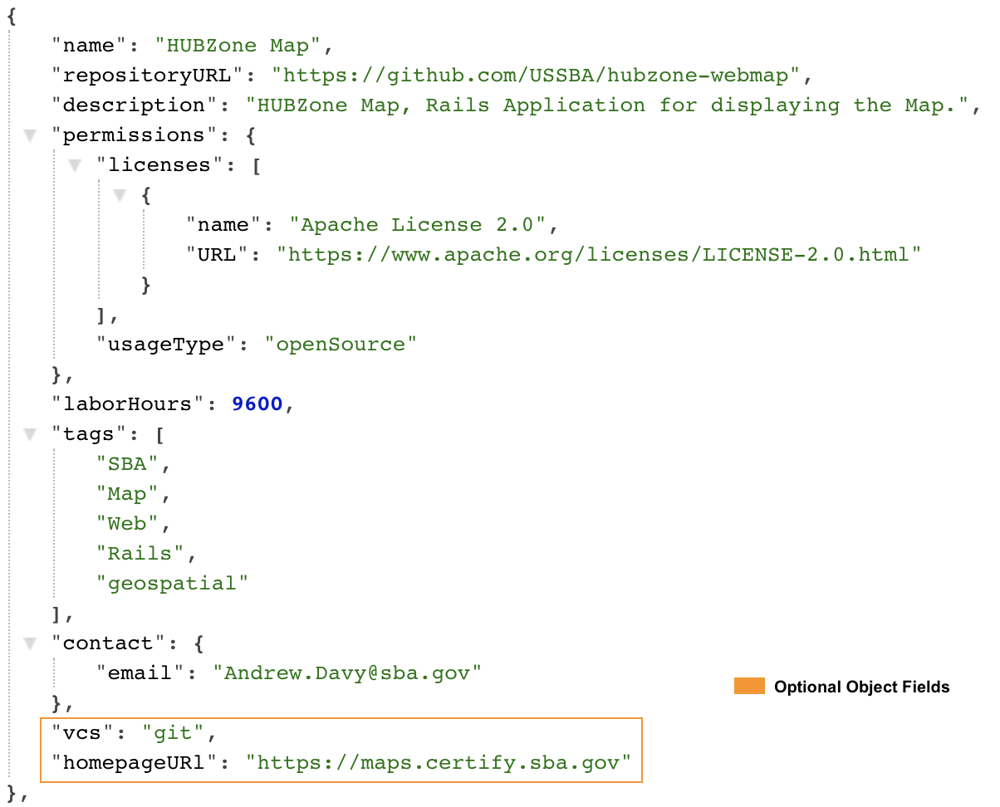
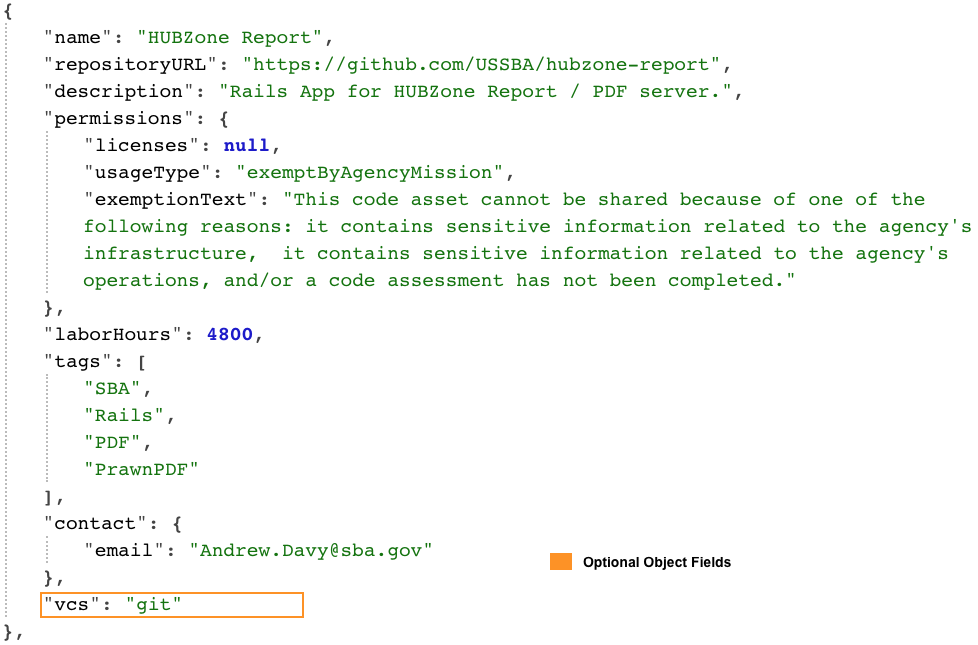
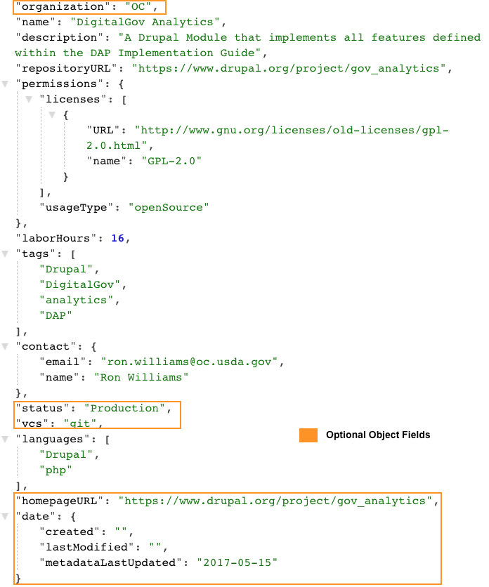

# Good Metadata Examples    
[Code.gov](https://www.code.gov) developed this document to showcase good examples of metadata in current agency code.json files.  We hope it helps when creating your agency code.json file.  

[Code.gov](https://www.code.gov) is the nation’s catalog for U.S. Government source code.  The platform allows for discoverability of custom developed software that is reusable or open sourced.  The current [metadata schema 2.0.0](https://code.gov/about/compliance/inventory-code) allows agency inventory metadata to be displayed properly on Code.gov.

Benefits of having **good** metadata:   
	- Allows for proper and accurate display of code inventory on Code.gov and agency websites.  
	- Allows for code discoverability and sharing among agencies, industry, academia, and open source developers.  
	- Increases probability of code contributions and collaboration from internal and external agency participants.  
	- Increases engagement with the open source community, including multiple levels of government, corporations, open source foundations, academia, startups, technology leaders, and individuals (see diagram below).  
   

       
### Example 1: DOD’s Move.mil         
The U.S. Department of Defense (DOD) does an excellent job with Move.mil by capturing all [metadata schema 2.0.0](https://code.gov/about/compliance/inventory-code) requirements and using optional fields to extend the OSS metadata. The project contains optional fields - **organization**, **status**, **vcs**, **homepageURL**, **relatedCode**, **reusedCode** and **date**.  The **relatedCode** and **reuseCode** fields are essential for identifying relevant codebases and software dependencies allowing engineering and open source contributors to easily access. The **organization** denotes Defense Digital Service department that is governing the OSS project, and then provides a **homepageURL** for the department’s website.
    

  
### Example 2: National Geospatial-Intelligence Agency (NGA)   
NGA does an excellent job describing the Conduit OSS project. They meet all the required fields and use the **organization** option field organization to narrow the management organization of the software.  Large agencies can use the organization field to denote the governing department/sub-agency or component of the OSS project. Optional fields like **status**, **vcs**, and **date** are always valuable information for searchability. 
  

    
### Example 3: NARA’s FederalRegister.gov Ruby API Client   
The U.S. National Archives and Records Administration (NARA) FederalRegister.gov Ruby API Client OSS project meets all the metadata required fields. NARA makes good use of the description, tags, and languages fields.  The optional fields (**organization**, **status**, **downloadURL**, **homepageURL**, and **date**) are valuable information for readers to understand the type of version control system (vcs) that is being used.  The **homepageURL** references the OSS governing subagency URL that readers can access to learn more about the OSS project. 
   

  
### Example 4: SBA’s HubZone Map  
U.S. Small Business Administration (SBA) captures all the [metadata schema 2.0.0 ](https://www.code.gov/#/policy-guide/docs/compliance/inventory-code)required fields on their HUBZone Map OSS project. The description is brief and direct and combined with the optional **homepageURL** field the metadata information provides the readers with the resource to learn more about the software solution. The **homepageURL** provides an interactive HUBZone Map that developers and readers can easily understand and visualize the software’s overall functionality.   
  

   
### Example 5: SBA’s HUBZone Report     
U.S. Small Business Administration (SBA)’s HUBZone Report project cannot be open sourced. For that reason SBA classifies the software usageType as exceptByAgencyMission with exceptionText describing the reason behind the exemption.  Clearly not all projects can be open source.  In this example, SBA provides clarification for the decision behind the exception.
   

  
### Example 6: USDA’s - DigitalGov Analytics
The U.S. Department of Agriculture (USDA)’s DigitalGov Analytics OSS meets all metadata required fields.  In this example the source code is hosted on Drupal.org, the **repositoryURL** and **homepageURL** reflect the website URL. Traditional open source communities like Drupal.org and WordPress.org host their projects on their platform vs. GitHub.com, BitBucket, etc. and it’s okay to reference those URLs. The optional **organization** field shows OC as the management component of the DigitalGov Analytics project to help identify the governing party of the OSS. 
   

   
### Example 7: USDA’s Animal Disease Spread Model       
The U.S. Department of Agriculture (USDA)’s Animal Disease Spread Model OSS makes good use of the tags field with descriptive keywords that enhance the OSS searchability.  Additional optional fields (**organization**, **name**, **status**, **vcs**, **languages**, **hompageURL**, and **date**) provide valuable information for the engineers and interested groups to easily repurpose the software and contribute to the development of the project. 
    
